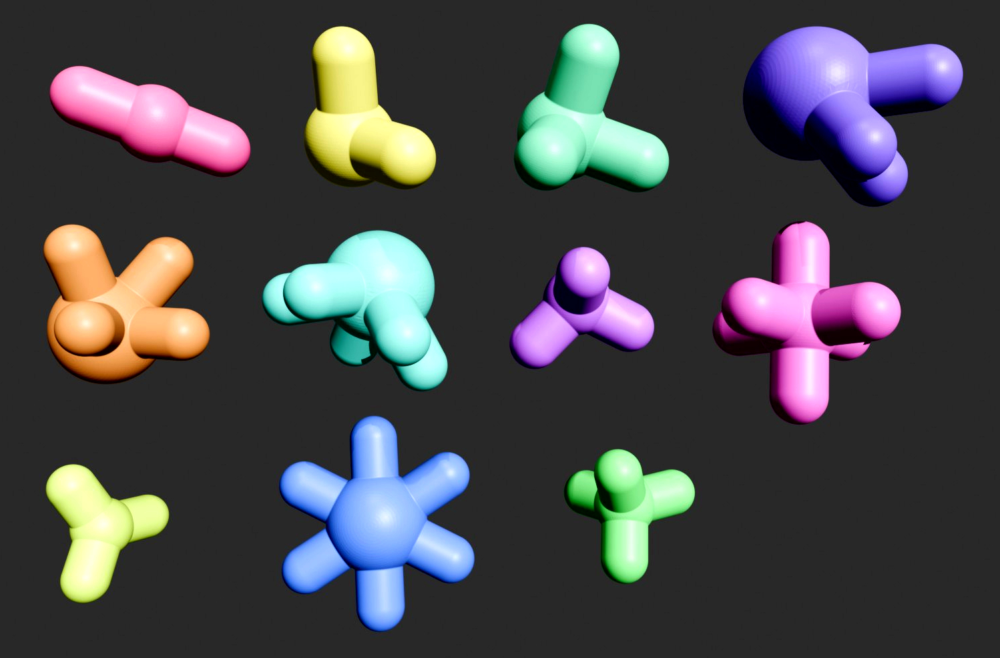
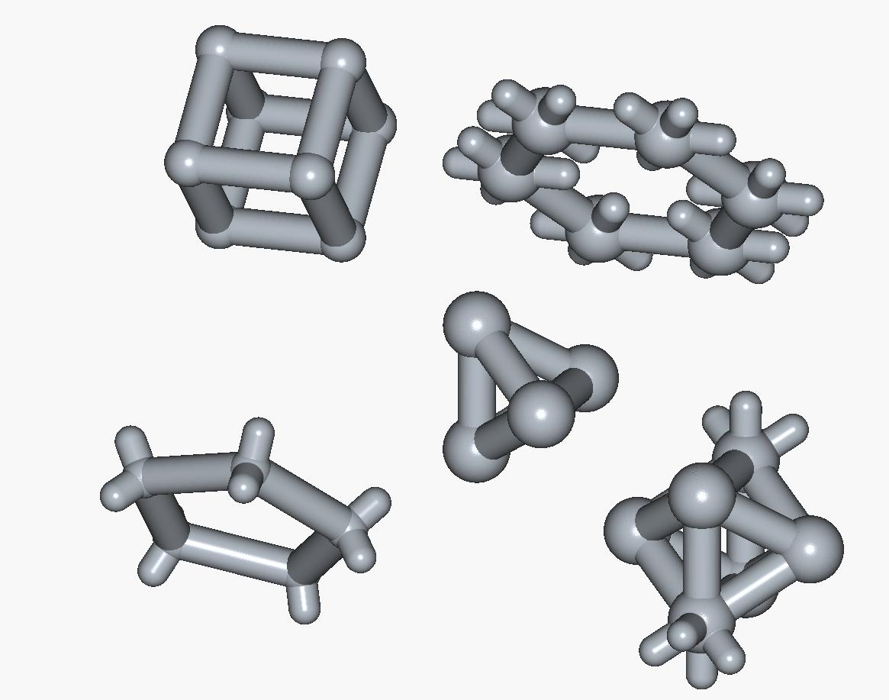

## GeoCore: Kids 3D Construction Set

### Overview
I came across hundreds of cardboard cores, and rather than throwing them away, I designed several types of hubs to connect them together.

If you have cardboard cores with an inner diameter of 25 mm, all you need to do is 3D print the hubs. Get the STL files **here**.

You can also automatically generate **custom-sized STL files** with a Python script—see below.

With these printed hubs and a handful of cardboard cores, you can build a wide range of 3D structures, from simple cubes and domes to complex geodesic frames and lattices. Each hub type provides a different connection geometry.

---


### Hubs


*(Hubs arranged in order, top-left to bottom-right.)*

##### 1. `straight_2.stl` — Inline Coupler *(top 1, pink)*
Connects two cores end-to-end in a straight line.  
Extend a rods’s length to build long beams and spans.

##### 2. `elbow_90_2.stl` — Right-Angle Elbow *(top 2, yellow)*
Joins two cores at a 90° angle.  
Useful for corners, mazes, or rectangular frames.

##### 3. `corner_cube_3.stl` — 3-Way Orthogonal Corner *(top 3, green)*
Connectors in the +X, +Y, and +Z directions.  
Build cubes, boxes, and scaffolds.

##### 4. `tetra_3.stl` — 3-Way ~60° Connector *(top 4)*
Three pegs meet at tetrahedral angles (≈60°).  
Create tetrahedra, triangular lattices, or trusses.

##### 5. `octa_4.stl` — 4-Way Orthogonal Pair Connector *(mid 1, orange)*
Four pegs arranged in perpendicular pairs.  
Build octahedra, space frames, or octet-truss modules.

##### 6. `icosa_5.stl` — 5-Way Icosahedral Vertex *(mid 2, teal)*
Five pegs radiate evenly from the center at about 63.43° between each.  
Assemble domes, geodesic spheres, and high-strength frameworks.

##### 7. `dodeca_3.stl` — 3-Way (Dodeca) *(mid 3, light purple)*
Three pegs meet at 108°, the golden-ratio angle of pentagons.  
Construct pentagons, decagons, and φ-based geometries.

##### 8. `cubic_6.stl` — 6-Way Cartesian Connector *(center, blue)*
Six pegs aligned along ±X, ±Y, ±Z axes.  
Build voxel grids, towers, bridges, and frame structures.

##### 9. `trigonal_planar_3.stl` — 3-Way Planar *(bottom 1, yellow-green)*
Three pegs in a single plane, equally spaced at 120°.  
Use for hexagonal or triangular tiling patterns and Y-junctions.

##### 10. `hex_planar_6.stl` — 6-Way Planar *(bottom 2, blue)*
Six coplanar pegs forming a hexagon (60° spacing).  
Use to create honeycomb sheets or dense triangular meshes.

##### 11. `tetrahedral_4.stl` — 4-Way Regular Tetrahedral *(bottom 3, green)*
Four pegs arranged at 109.47°, matching tetrahedral geometry.  
Used for diamond-like lattices, rigid trusses, or alternating with `octa_4` for octet structures.

---

### Rods


I started with a box of cardboard cores. They are 102 mm long, with an inner diameter of 25 mm and outer diameter of 30 mm.

Ideally, we need a few different lengths. Initially, I didn’t plan to use multiple lengths, but they are essential to create all the different shapes.

- **√2** for square diagonals: In a square with side length L, the diagonal measures L·√2, so a √2·L rod fits perfectly across a square’s corner-to-corner span.

- **φ** for pentagon diagonals: In a regular pentagon with side length L, the long diagonal is φ·L (golden ratio), so a φ·L rod matches that vertex-to-vertex distance.

- **2×** for larger models: A 2·L rod simply doubles the base length to scale up spans and frames while keeping proportions consistent. 

So if the base size is 102 mm:
- `L = 102 mm`  
- `√2 · L ≈ 144 mm`  
- `φ · L ≈ 165 mm`  
- `2L = 204 mm`

Rod factories are included in the script and STL files as well. You may need to adjust clearances depending on your printer and materials.  *(Note that I've only tested parameters that match my cardboard cores.*)


---

### Generate Your Own Custom-Sized Hubs

The script creates parametric, 3D-printable hubs and rods for building wireframe solids and space frames, in STL format.

There are 11 different hub types.  Each hub offers a distinct set of connection directions and angles, (planar, orthogonal, and the tetrahedral/octahedral/icosahedral families) so builders have the specific joints needed to assemble squares, triangles, pentagons, 3D lattices, and geodesic structures accurately.

Each hub is a sphere with several pegs that press-fit into the cores.  

The sphere size is calculated from the smallest angle between any two pegs so they don’t collide, while keeping a safe wall thickness. Nodes with 60° separations (e.g., `tetra_3`, `octa_4`, `icosa_5`) need larger spheres.

Fit and appearance are controlled by only a few parameters.

##### Parameters
```
HUB_FIT_CLEARANCE = -0.3     # Negative oversize for grip
HUB_INSERTION_DEPTH = 22.0    # Peg contact length

ROD_OD = 30.0
ROD_ID = 25.0
ROD_LENGTH = 102.0
ROD_END_CHAMFER = 0.5
```

If you prefer a uniform hub size, set the **BALL_R_OVERRIDE** parameter to a constant that fits the largest hub.

```
from
BALL_R_OVERRIDE = None
to
BALL_R_OVERRIDE = 2.0 * plug_r + safety
```

##### Run

Install CadQuery:
```bash
pip install cadquery
```

Then run the script to generate 11 hubs and 4 rods as STL files in **./stl/**.

---

#### 3D Printing
I used SuperSlicer and a Prusa i3 MK3S+ with PLA. 


Random PLA filaments I had in stock, printinted in draft quality.


With cardboard cores attached

---

#### Build Things


The above pics represents what ChatGPT5 came up with using these parts.
